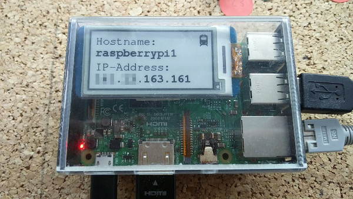

# ShowIPEinkRPi
Show hostname and Ip-address on a waveshare eInk display.

# Installation
Install Raspian and copy these files to `/home/pi/.config/autostart`.
You can edit the `train.bmp` with e.g. Paint and change the background.

# Display
I used the [2.13inch E-Ink display HAT for Raspberry Pi](https://www.waveshare.com/2.13inch-e-Paper-HAT.htm)

